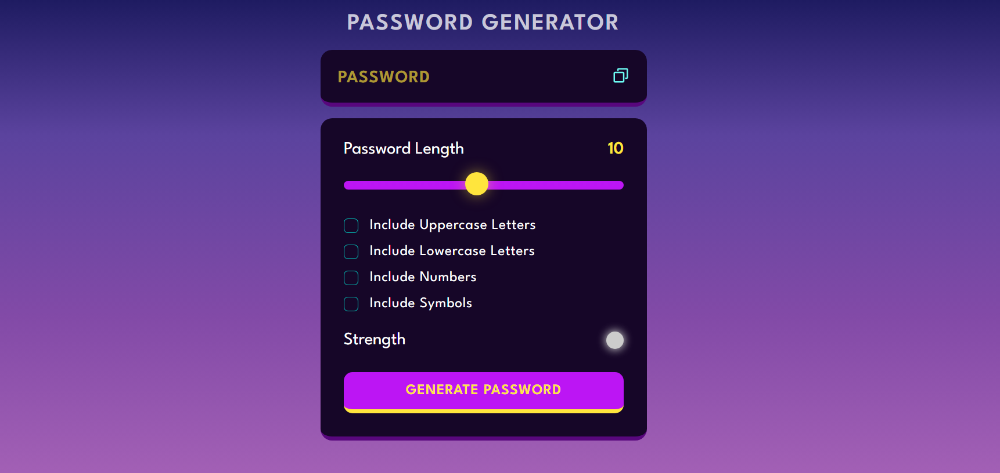

# Password Generator Website

[](https://github.com/YourUsername/sArtHak03804/blob/main/LICENSE)
[](https://developer.mozilla.org/en-US/docs/Web/Guide/HTML/HTML5)
[](https://developer.mozilla.org/en-US/docs/Archive/CSS3)
[](https://developer.mozilla.org/en-US/docs/Web/JavaScript)
[](https://github.com/sArtHak03804/password_generator/issues)
[](https://github.com/sArtHak03804/password_generator/pulls)




A simple password generator website built using HTML, CSS, and JavaScript. This website allows users to generate secure passwords with various options for complexity.

## Features

- Generate random passwords with customizable options.
- Choose password length, including uppercase, lowercase, numbers, and special characters.
- Copy generated passwords to the clipboard.
- Responsive design for both desktop and mobile devices.

## Demo

Check out the live demo of the Password Generator Website [here](https://sArtHak03804.github.io/password_generator).

## Getting Started

1. Clone the repository:

```bash
git clone https://github.com/sArtHak03804/password_generator.git
```
2. Open the `index.html` file in your preferred web browser.

## Contributing

Contributions are welcome! Please follow these steps:

1. Fork the repository.
2. Create a new branch: `git checkout -b feature/your-feature-name`.
3. Make your changes and commit them: `git commit -m "Add your feature"`.
4. Push to the branch: `git push origin feature/your-feature-name`.
5. Open a pull request.

## License

This project is licensed under the [MIT License](LICENSE).
